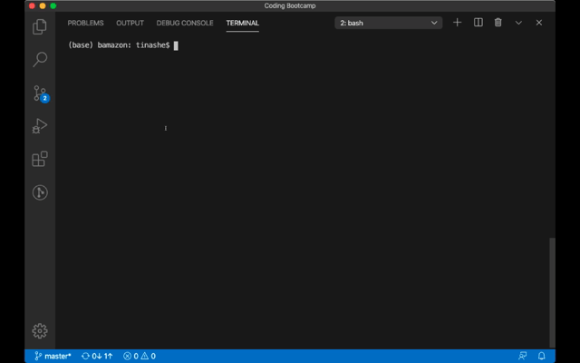

# LIRI

### Summary
bamazon is a command line store front application written in NodeJS. When the app runs, a user can view the product catalog, the interface will prompt the user to select a desired product and the quantity. If enough quantities of the desired prduct are available, the app returns a message confirming the transaction otherwise it prompts to select another product.

### Usage
To use bamazon, navigate or cd into bamazon directory and run the following commands:
- npm install
- node bamazonCustomer.js

## Requirements
LIRI uses NodeJS and the following npm packages:
- MySQL
- Node.JS
- Javascript

# Demo

